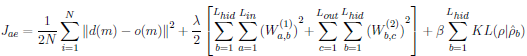
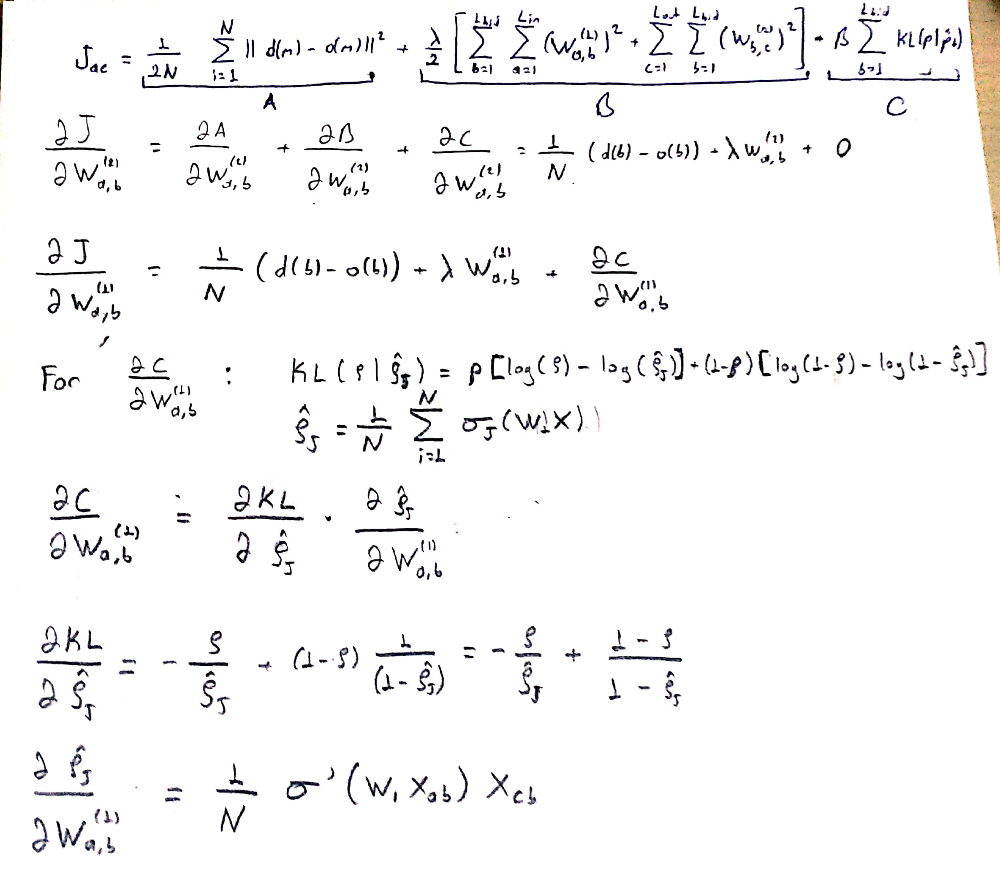

# Autoencoder
## Sparse Autoencoder for Image Data

An autoencoder neural network is an unsupervised learning algorithm that applies backpropagation, setting the target values to be equal to the inputs. i.e., it is to generate a function of the form y(i) = x(i).

